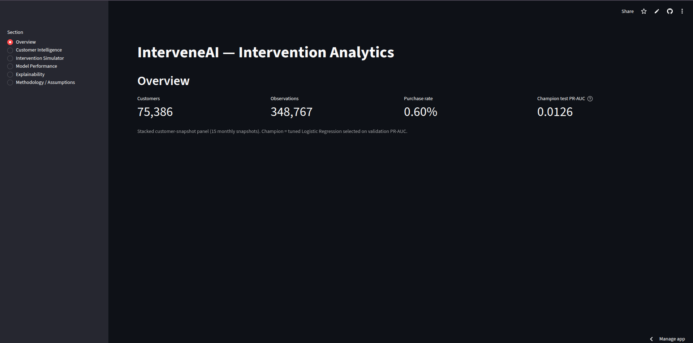
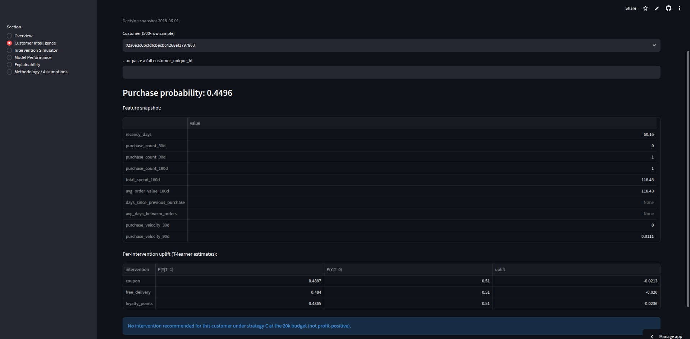
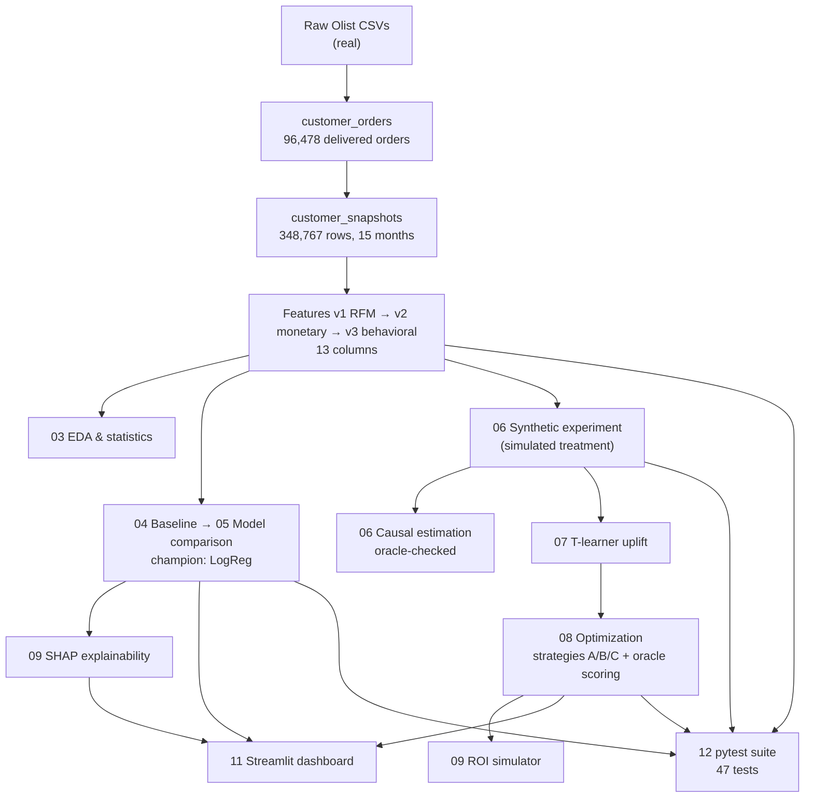
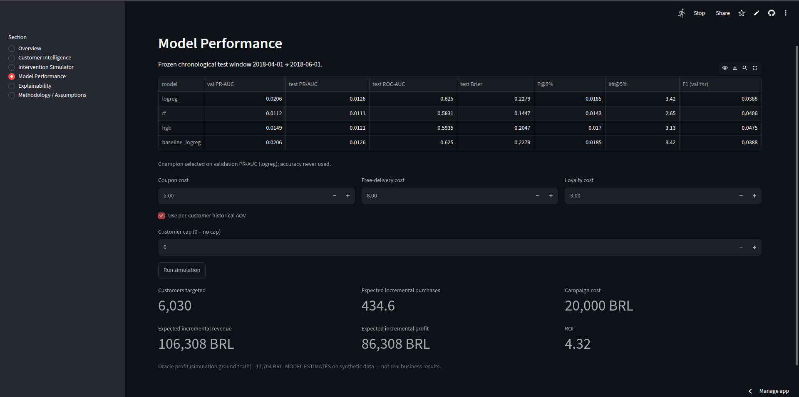
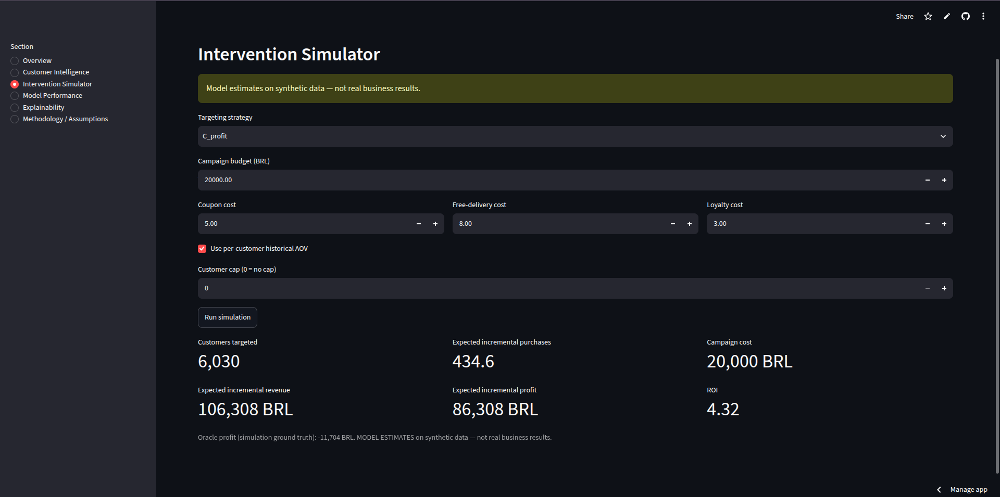
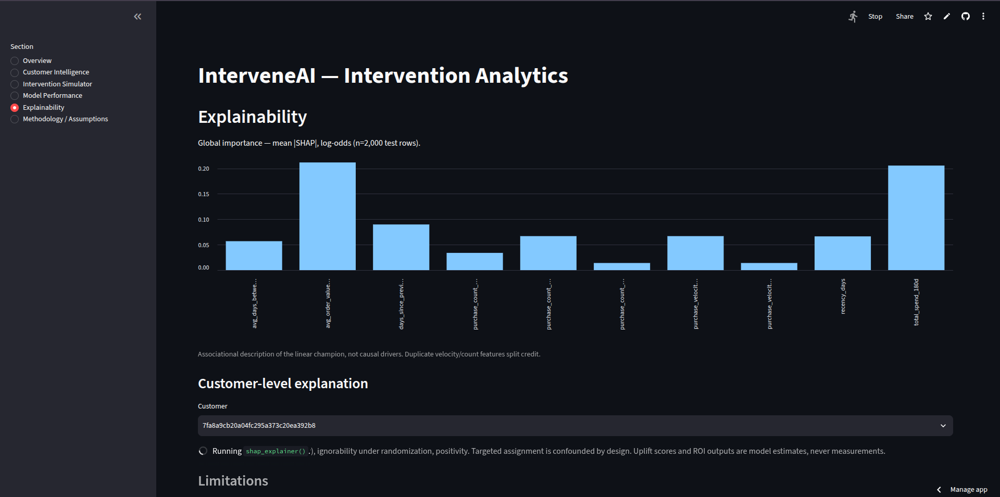

# InterveneAI
### Causal Customer Intelligence & Intervention Optimization Platform

An end-to-end data science platform on the Olist Brazilian e-commerce data:
predict who will repurchase, estimate intervention effects on a **synthetic**
experiment (Olist contains no real experiment), rank customers by incremental
benefit — not purchase probability — and optimize spend under a budget, with
every number below coming from executed pipeline outputs.

> **Evidence rule for this document.** Every metric cited is generated by the
> pipeline (scripts, notebooks, tests). Nothing is invented. Synthetic
> quantities are labeled as model estimates throughout.


**Who will buy, who buys *because of* the intervention, and is it worth the
money — answered with evidence, including the answers that failed.**



> **The headline result is an honest negative one.** The optimizer believes a
> 20k BRL campaign earns **+86,308 BRL**; simulation ground truth says
> **−11,704 BRL** — and *treat-nobody* beats every strategy. This project
> reports that gap instead of hiding it.

| In 30 seconds | |
|---|---|
| Problem | Target costly interventions under a budget (Olist e-commerce) |
| Key trick | Uplift (incremental benefit), never raw purchase probability |
| Data | 348,767 customer-snapshots; 0.60% repurchase rate (166:1 imbalance) |
| Model | LogReg champion: test PR-AUC **0.0126**, lift@5% **3.42x** |
| Proof | 47 passing tests; every number pipeline-generated; live dashboard |

**Contents:** Problem · [Why prediction fails](#2-why-normal-purchase-prediction-is-insufficient) · [EDA](#9-eda-findings-notebooks03) · [Modeling](#10-predictive-modeling) · [Causal](#13-causal-inference-notebooks06) · [Uplift](#14-uplift-modeling-notebooks07) · [Optimization](#15-intervention-optimization-notebooks08) · [ROI](#16-roi-simulator-notebooks09-simulate_roi) · [Explainability](#17-explainability-notebooks09-shap-0520) · [Dashboard](#18-streamlit-dashboard-dashboardapppy) · [Run it](#21-how-to-run) · [Results](#23-results)

---

## 1. Problem statement

A retailer can contact only a fraction of its customer base with a costly
intervention (coupon, free delivery, loyalty points). Three questions must be
answered in order: **who** will buy next, **who buys because of** the
intervention, and **is the intervention worth its cost** under a fixed budget?
InterveneAI answers all three — and shows, honestly, where the answers are
weak.

## 2. Why normal purchase prediction is insufficient

A purchase-probability model targets **sure things**: customers who buy
anyway. Measured on actual outputs, the top-10% by predicted purchase
probability overlaps the top-10% by predicted uplift by only **0.3%**, with
far higher no-treatment purchase probabilities (0.59 vs 0.38) — yet captures
no more incremental gain (AUUC 109.3 vs 109.0 vs random 104.4). Strategy A
(target likely buyers) has model-negative expected profit at every budget
(−21,638 BRL at 20k). "Who buys" can never substitute for "who benefits."


*Live dashboard: one customer, purchase probability 0.45, feature snapshot,
and a per-intervention uplift table — the personalized view behind the
aggregate numbers.*

## 3. Solution overview

Stacked customer-snapshot panel → leakage-audited behavioral features →
chronological rare-event modeling (PR-AUC-driven) → synthetic randomized
experiment with known ground truth → causal estimation with oracle checks →
T-learner uplift → profit-greedy optimization scored against ground truth →
SHAP explanations, ROI simulator, and a 6-section Streamlit dashboard. Tests
(47, passing) guard every stage.

## 4. Architecture diagram



## 5. Dataset

**REAL DATA:** Olist Brazilian E-Commerce Public Dataset — 96,478 delivered
orders from 93,358 customers (2016-09-15 → 2018-08-29), plus order payments
for monetary features. **SIMULATED DATA:** the intervention/treatment
experiment (`data/synthetic/intervention_experiment.parquet`, 348,767 rows):
treatment arm, assumed costs (0/5/8/3 BRL), seeded Bernoulli outcomes, and
oracle `true_propensity` / `true_cate` columns reserved for method
validation — never model inputs.

## 6. Data preprocessing

`build_customer_orders.py` attaches the true `customer_unique_id`, keeps
delivered orders, sorts chronologically. `build_customer_snapshots.py` emits
one row per customer active in each 180-day history window with a 60-day
forward target (`notebooks/04` verifies 2,085 positives).

## 7. Customer snapshot methodology

15 month-start snapshots (2017-04-01 → 2018-06-01); 75,386 unique customers,
median 5 snapshots each. History window [snapshot−180d, snapshot) with strict
`< snapshot_date`; target window [snapshot, snapshot+60d). Snapshot-month
splits (not random rows) define all train/val/test boundaries, so evaluation
reproduces deployment reality.

## 8. Feature engineering

- v1 (RFM): `recency_days`, `purchase_count_180d`.
- v2 (monetary): `total_spend_180d`, `avg_order_value_180d` (payments
  aggregated order-first).
- v3 (behavioral, Phase 2): `purchase_count_30d/90d`,
  `days_since_previous_purchase` (last inter-order gap), 
  `avg_days_between_orders`, `purchase_velocity_30d/90d`. Strict
  `order_purchase_timestamp < snapshot_date` rule; 2,000-row order-by-order
  leakage audit plus recomputation-equality with v2 — all passing. Gap NaNs
  (338,488 single-prior rows) are never imputed.

## 9. EDA findings (`notebooks/03`, all with CIs/tests/effect sizes)

- Target 0.5978% (Wilson CI 0.5728–0.624%); imbalance 166.3:1.
- Recency gradient 0.90% → 0.41% (Cramér's V 0.022); frequency gradient
  0.55% → 2.07% → 9.82% (V 0.053, strongest signal) — yet 90.4% of positives
  are single-order rows.
- Money barely separates: spend AUC 0.519, AOV AUC 0.499 (p = 0.93).
- Repeat history 2.54% vs 0.54% (risk ratio 4.7); within history-holders,
  longer gaps tilt positive (medians 27 vs 14d) — descriptive, n = 261.
- All feature–target |Spearman| ≤ 0.04; velocities duplicate counts (ρ = 1.0),
  spend duplicates AOV (ρ ≈ 0.99).
- Temporally stable (0.50–0.72%/month, V = 0.009); spend tail (8% of rows)
  repurchases at base rate; max-spend row (13,664 BRL) is negative.
- No causal claims: every section separates observed association,
  statistical evidence, and (absent) causal interpretation.

## 10. Predictive modeling

Chronological 9/3/3-month splits (train 140,605 rows/943 pos; val
93,774/522; test 114,388/620). Candidates: tuned LogReg, Random Forest,
HistGradientBoosting (+ untuned baseline reference); selection on **validation
PR-AUC**. One RF config scored val ROC-AUC 0.483 (worse than random).
**Champion: Logistic Regression (C = 1.0)** — identical to the baseline, so
tuning validated the default: test **PR-AUC 0.0126** (random 0.0054),
**ROC-AUC 0.625**, Brier 0.228; F1 0.019 @0.5 → 0.039 @val-threshold 0.870;
lift 6.62x/3.42x/2.53x at top-1/5/10%. HGB led test F1 (0.048), RF led Brier
(0.145) — ranking, the task at hand, favored LogReg on PR-AUC, ROC-AUC and
lift@5% simultaneously.


*Live dashboard: one curve per candidate — the rare-event PR curve (left)
vs the flattering ROC (right).*

## 11. Class imbalance strategy

166:1 positives. Accuracy never computed for selection; majority baseline
(99.40%) reported only to disqualify accuracy. `class_weight="balanced"` (no
resampling, nothing synthetic), PR-AUC primary, precision@k/lift for
operating points — with the documented cost that balanced weights destroy
calibration (Brier 0.228 vs 0.0054 constant; operating threshold 0.870):
scores are rankers, not probabilities.

## 12. Experiment simulation

`src/causal/simulate_experiment.py` (`--mechanism random|targeted`,
`--arm-probs`, `--seed`; default 0.4/0.2/0.2/0.2, seed 42). Documented DGP:
base ≈0.6% control rate; assumed effects coupon **+0.8pp**, delivery
**+0.5pp**, loyalty **+0.3pp** (50% larger when recently active); observed
simulated rates 0.62% / 1.56% / 1.14% / 0.98% — ordered as assumed, by
construction. Validation: proportions, exact costs, binary outcomes, real
target absent, same-seed identical. Targeted mode confounds by design for
later adjustment tests.

## 13. Causal inference (`notebooks/06`)

Difference-in-means, IPW (bootstrap CI), regression adjustment (HC1 CI) —
transparent scipy/statsmodels/sklearn (no causal libs installed):
coupon **+0.945pp** (CI 0.846–1.047, RR 2.53), delivery **+0.524pp**
(0.437–0.615, RR 1.85), loyalty **+0.357pp** (0.275–0.443, RR 1.58); all 9
estimate CIs and all 24 segment CIs cover oracle truth. Balance max|SMD|
0.010 under randomization vs −0.46 under targeting, where naive estimates
drift upward and OLS adjustment recovers truth — the demonstration of why
randomization matters. **No claims about real Olist customers.**

## 14. Uplift modeling (`notebooks/07`)

T-learner (two LogRegs) per arm, coupon primary, frozen test window, Qini /
AUUC / Qini-coefficient / decile calibration / 4 uplift segments, all
verified by recomputation. Honest negative result: Qini coefficients **0.043
/ −0.118 / 0.034**, uplift–oracle spearman ≈ 0, deciles non-monotone,
magnitudes absurd (−48pp to +55pp vs ~1pp reality). With ~1% base rates and
weak linear features, two near-identical purchase rankings differ by noise.
The "negative" segment still shows +0.72% observed — score bins, not effects.

## 15. Intervention optimization (`notebooks/08`)

Decision snapshot 2018-06-01 (38,376 customers). Per customer×arm from actual
T-learner outputs: P(Y|T=0), P(Y|T=arm), uplift, cost, revenue (uplift × own
AOV), profit. Greedy one-arm-per-customer allocation within budget; A ranks
by purchase prob, B by uplift, C by profit (positive-only). At 20k budget:
A treats 4,493 (model −21,638 / oracle −6,906), B 6,170 (+41,955 / −17,791),
C 6,030 (+86,308 / −11,704). Oracle-optimal is treat-nobody: true effects
(≤0.9pp × ~158 BRL ≈ ≤1.4 BRL) cannot cover 3–8 BRL costs. Model ranking
(C > B > A) does not transfer to oracle (A > C > B) — miscalibrated
optimization manufactures confidence, not profit.


*Live dashboard: 6,030 targeted, ROI 4.32 believed — oracle −11,704. The
gap between the two numbers is the finding.*

## 16. ROI simulator (`notebooks/09`, `simulate_roi()`)

Changeable budget, per-arm costs, order value (scalar or per-customer AOV),
customer cap, strategy → targeted count, expected incremental purchases /
revenue, cost, profit, ROI — each beside its oracle counterpart, all labeled
estimates. Example: C @5k claims ROI **8.41** (+42,043) while oracle says
−761. Order value 100→400 BRL swings model profit 35k→199k with oracle flat
≈ −17.8k; halved costs double targeting yet worsen oracle to −28.3k.
Assumptions move belief, not truth.

## 17. Explainability (`notebooks/09`, SHAP 0.52.0)

LinearExplainer (exact) on the champion: global mean|SHAP| — AOV 0.207,
last-gap 0.204, spend 0.202, recency fifth (0.067); duplicates split credit.


*Live dashboard: money and repeat-history features dominate; recency trails.*
Individual: top customer (P = 0.999) rides one extreme gap value (+9.46
log-odds) — outlier leverage, faithfully shown; median customer (P = 0.45)
flat. Sums verified = model log-odds. Associational only.

## 18. Streamlit dashboard (`dashboard/app.py`)

Six sections — Overview (75,386 customers; 348,767 rows; 0.60%; PR-AUC
0.0126), Customer Intelligence (ID lookup, purchase prob, per-arm uplift,
saved recommendation), Intervention Simulator (live `simulate_roi`),
Model Performance (comparison table, recomputed PR/ROC, calibration, lift),
Explainability (global SHAP + per-customer bars), Methodology/Assumptions.
Zero hardcoded metrics (audited); AppTest-verified: all sections render, KPIs
asserted, simulator reproduces notebook numbers exactly.

## 19. Project structure

```
data/{raw,processed,synthetic}  src/{data,models,evaluation,causal,features,optimization}
models/  notebooks/03..09  dashboard/app.py  docs/synthetic_intervention.md  tests/
```

## 20. Installation instructions

```
python -m venv .venv && .venv/bin/pip install -r requirements.txt
```
(shap, streamlit, pytest included). Run from the repo root; seeds fixed at 42.

## 21. How to run

```
.venv/bin/python src/data/build_customer_orders.py
.venv/bin/python src/data/build_customer_snapshots.py
.venv/bin/python src/data/build_rfm_features.py
.venv/bin/python src/data/build_monetary_features.py
.venv/bin/python src/data/build_behavioral_features.py
.venv/bin/python src/models/train_baseline.py
.venv/bin/python src/models/train_models.py
.venv/bin/python src/causal/simulate_experiment.py
.venv/bin/python src/causal/estimate_effects.py
.venv/bin/python src/causal/uplift_model.py
.venv/bin/python src/optimization/intervention_optimizer.py
.venv/bin/python src/evaluation/explainability.py
.venv/bin/python -m pytest tests/ -q
export PATH="$PWD/.venv/bin:$PATH"   # repo kernel spec calls bare `python`
jupyter nbconvert --to notebook --execute notebooks/03_eda_and_statistics.ipynb --output 03_eda_and_statistics.ipynb
# … same pattern for 04–09 …
.venv/bin/streamlit run dashboard/app.py
```

## 22. Testing

`.venv/bin/python -m pytest tests/ -q` — **47 passed (~9s)**, deterministic:
identity, uniqueness, temporal leakage (500-row order-by-order recheck),
feature math, target integrity (exactly 2,085 positives; 300-row order
spot-check), split ordering vs saved JSONs, simulation reproducibility,
uplift identities, budget adherence in all 12 saved scenarios, optimization
schema. No working code was rewritten for tests.

## 23. Results

A complete, honest pipeline: leakage-audited behavioral features; rare-event
champion (PR-AUC 0.0126, lift@5% 3.42x); synthetic experiment whose assumed
effects are recovered by three estimators with full oracle coverage;
documented failures (uplift ≈ random; model profits vs oracle losses;
miscalibration) reported as findings, not hidden. The system recommends by
incremental value under budget — and proves, via ground truth, when the
honest answer is *do not treat*.

## Limitations and future improvements

Non-independent stacked rows (optimistic p-values); weak linear signal;
miscalibrated scores; simple additive DGP without interference/carryover/
non-compliance; greedy (not optimal) knapsack; single-snapshot, single-split
evaluation; oracles exist only in simulation. Next: rolling-window
validation, contrast-aware uplift learners, calibration-preserving imbalance
handling, cost-sensitive learning, and — before any real deployment — a real
randomized experiment, since nothing here measures actual customer response.
